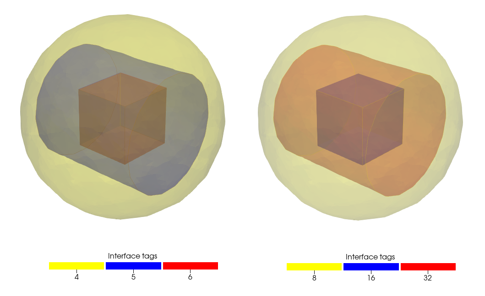

:orphan:

.. _ExampleDomaindoc:

Domain Examples
=================================

The construction of volumetric meshes is done with the SVMTK Domain class, and we will show some examples on mesh construction.

Meshing an implicit function.
~~~~~~~~~~~~~~~~~~~~~~~~~~~~~~~~~~~~~~~~

In this example, we will create a mesh of the chair function (insert citation) using implicit surface function used in :ref:`implicit`

.. literalinclude:: ../../examples/Domain/example_make_implicit_mesh.py

   
   ..
   
   Volume mesh of chair function.

Meshing with three surfaces.
~~~~~~~~~~~~~~~~~~~~~~~~~~~~~~~~~~~~~~~~~~~~

The next step is to mesh with multiple surfaces, and in this example we will create a volumetric mesh using 3 surfaces.

.. literalinclude:: ../../examples/Domain/example_meshing_multiple_surfaces.py
   
   

   
   ..
   
   Volume mesh with multiple surfaces

.. _subdomain:

Meshing with SubdomainMap.
~~~~~~~~~~~~~~~~~~~~~~~~~~~~~~~~~~~~~~~~~~~~

In this example, we create a volumetric mesh and mark different subdomains with :class:`SVMTK.SubdomainMap` (see Guide SubdomainMap). 
(Include what is a subdomain?)

.. literalinclude:: ../../examples/Domain/example_mesh_with_subdomainmap.py

   
   ..
   
   Right: Volume mesh without SubdomainMap. Left: Volume mesh with SubdomainMap.
   
Contextual, we have that without :class:`SVMTK.SubdomainMap` object, the subdomain tag is determined by the decimal conversion of the binary string; 

* "100" --> 1 
* "110" --> 3
* "111" --> 7

Marking interfaces between subdomains.
~~~~~~~~~~~~~~~~~~~~~~~~~~~~~~~~~~~~~~~~~~~~~~~~

The interface between subdomains is automatically generated, but this require that the use looks up the interface tag. Instead, we can actively set the interface tag with :class:`SVMTK.SubdomainMap`, thus streamlining the mesh construction. While setting the subdomain tags is done during the mesh construction, the marking of the interface is done when writing the mesh to file.  

.. literalinclude:: ../../examples/Domain/example_mark_subdomain_interfaces.py

   
   ..
   
   Right: Volume mesh without interface markings. Left: Volume mesh with interface markings.

Remove subdomains. 
~~~~~~~~~~~~~~~~~~~~~~~~~~~~~~~~~~~~~~~~~~~~

We can use the zero tag with :class:`SVMTK.SubdomainMap` to avoid meshing subdomains. However, in some cases we still want the interface to be marked. This can be done by removing the subdomain(s) after the mesh is constructed, which will preserve the interface tag as if the subdomain was not removed.
We will follow the script from example :ref:`subdomain`.

.. literalinclude:: ../../examples/Domain/example_remove_subdomain.py

   
   ..
   
   Right: Volume mesh with subdomains. Left: Volume mesh with a subdomain removed.

.. _sharp_edges:

Meshing with sharp border edges. 
~~~~~~~~~~~~~~~~~~~~~~~~~~~~~~~~~~~~~~~~~~~~~

Mathematical models sometimes require straight boundary in order to apply the boundary conditions. This means that the mesh will have sharp edges, and we will in this example how to preserve sharp edes.  
 
.. literalinclude:: ../../examples/Domain/example_preserve_surface_borders.py

   
   ..
   
   Volume mesh with preserved sharp edges.
    

.. _bifurcation:

Conforming 1D bifurcation inside a cube.
~~~~~~~~~~~~~~~~~~~~~~~~~~~~~~~~~~~~~~~~~~~~
 
We will in this example shows how to add a conforming 1D edge bifurcation inside a cube. This require that the each edge in the bifurcation correponds to a separate polyline. 

.. literalinclude:: ../../examples/Domain/example_bifurcation_in_cube.py

 
   ..
   
   Bifurcation inside a cube mesh
   
    
Conforming 1D helix feature inside cylinder. 
~~~~~~~~~~~~~~~~~~~~~~~~~~~~~~~~~~~~~~~~~~~~~

This example follows the :ref:`bifurcation` n how to add a conforming 1D edges to the mesh. 
 
.. literalinclude:: ../../examples/Domain/example_heliix_edges_in_cylinder.py
      

   
   ..
   
   Helix conforming edges inside cylinder
   
It is important to note that 1D features that extend outside the surface will
cause irregularities on the mesh boundary.

Meshing with sharp border edges in plane. 
~~~~~~~~~~~~~~~~~~~~~~~~~~~~~~~~~~~~~~~~~~~~~
 
In example 
:ref:`sharp_edges`, we focused on preserving sharp edges of a surface. 
However, for complex surface meshes, this function will often find more sharp edges than  
the user might intend. In particular, after using the 
:func:`clip` 
function. Therefore, we will in this example show how to 
preserve sharp edges in a plane.
 
.. literalinclude:: ../../examples/Domain/example_preserve_surface_borders_in_plane.py

   
   ..
   
   Volume mesh with preserved sharp edges near plane.
   
   
.. raw:: latex

    \newpage
