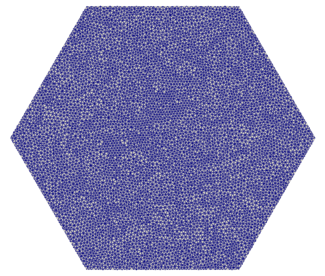
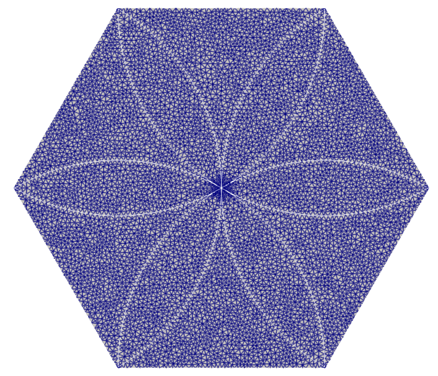
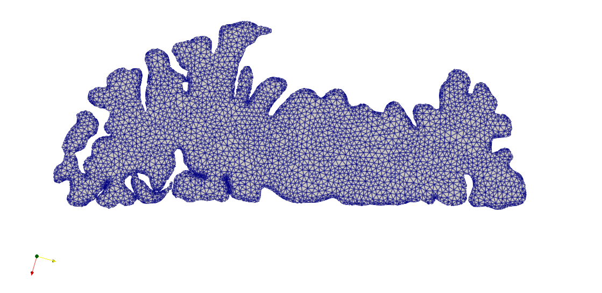

:orphan:

.. _ExampleSlicedoc:

Slice Examples
=================================

The SVMTK Slice class can be used to create a 2D mesh, and we will here show some examples on how to utilize the different functionalities.

How to make a 2D mesh
~~~~~~~~~~~~~~~~~~~~~~~~~~~~~~~~~

The first example is on how to construct a 2D mesh given some constraints, i.e. boundaries. 

.. literalinclude:: ../../examples/Slice/example_make_2d_mesh.py
   :lines: 1-22
   

   .. 
   
   Hexagon slice mesh.

In some cases, contradicting constraints can cause the mesh construction to crash, as the mesh criteria fails to create a mesh with both constraints. This would happen in the next example, however if we slightly change the hexagon radius, it will no longer crash.

.. literalinclude:: ../../examples/Slice/example_make_2d_mesh.py
   :lines: 24-

   
   .. 
   
   Hexagon slice mesh with petals.

Combining Slices
~~~~~~~~~~~~~~~~~~~~~~~~~~~~~~~~~

This example will show the method to combine slice constraints from different slices.

.. literalinclude:: ../../examples/Slice/example_combine_slices.py

   

   .. 
   
   Combining a circle and a square slice.

Add Subdomains to a slice mesh.
~~~~~~~~~~~~~~~~~~~~~~~~~~~~~~~~~

In this example, we will show how to add and also remove subdomains from a slice mesh. The methodology is similar to :class:`SVMTK.Surface`
and it works with :class:`SVMTK.SubdomainMap` 

.. literalinclude:: ../../examples/Slice/example_add_subdomain_tags.py

   
   ..
   
   Adding 3 subdomains to the mesh.
   
   

   
   ..
   
   Removing one subdomains from the mesh.
   

Keeping largest component 
~~~~~~~~~~~~~~~~~~~~~~~~~~~~~~~~~

Slicing complex surfaces can result in isolated clusters of faces. In this example, we will show the function :func:`SVMTK.Slice.keep_largest_connected_component`. It is worth mentioning that this method require the function :func:`SVMTK.Slice.add_surface_domains` to remove helping faces.

.. literalinclude:: ../../examples/Slice/example_keep_largest_connected_component.py

   
   .. 
   
   Slice mesh with helping faces.

   
   .. 
   
   Slice mesh without helping faces.

   
   .. 
   
   Slice mesh of the largest connected component.

   
Export as surface
~~~~~~~~~~~~~~~~~~~~~~~~~~~~~~~~~

The z-coordinate in slice meshes will be zero. (Likely to be removed, need additional utility) 

   .. 
   
   The first and second slice mesh respectively marked as yellow and red.

.. raw:: latex

    \newpage

