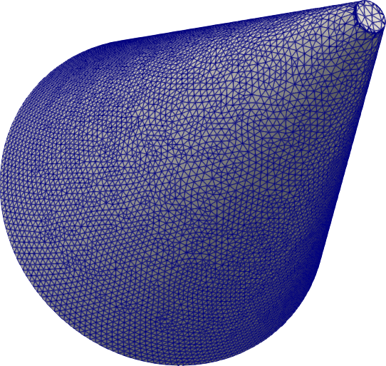
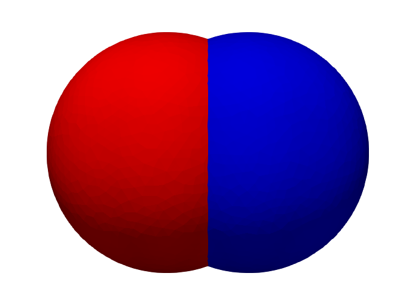

:orphan:

.. _ExampleSurfacedoc:

Surface Examples
=================================

We will give a few examples of SVMTK Surface class and its functionality. (Write More) 

Triangulate vertices
~~~~~~~~~~~~~~~~~~~~~~~~~~~~~~~~~
 
We start of with a simple example that uses   
:func:`SVMTK.Surface.triangulate_faces` to create faces between
vertices.   
 
.. literalinclude:: ../../examples/Surface/example_triangulate.py

   ..
   
   Triangulation of faces.

.. _union:

Boolean Operations
~~~~~~~~~~~~~~~~~~~~~~~~~~~~~~~~~

The next examples is made to illustrate the boolean operations between two surface, i.e. union, difference and intersection. 

.. literalinclude:: ../../examples/Surface/example_boolean_operations.py

   
   ..
   
   The initial surfaces for boolean operations.
   

   
   ..
   
   The resulting surface after boolean union operation.

   ..
   
   The resulting surface after boolean difference operation.

   ..
   
   The resulting surface after boolean intersection operation.

.. _make_cylinder:

Make Surface of Constructive Solid Geometry.
~~~~~~~~~~~~~~~~~~~~~~~~~~~~~~~~~~~~~~~~~~~~~~~~~~~~~~~~~~~~~~~~~~~~~~

We will in this example go through some simple geometries that can be constructed with SVMTK, such as cube, sphere, cylinder and cone.

.. literalinclude:: ../../examples/Surface/example_make_csg_geometries.py
   :lines: -13

.. literalinclude:: ../../examples/Surface/example_make_csg_geometries.py
   :lines: 15-22

   
   ..
   
   Cube surface mesh

.. literalinclude:: ../../examples/Surface/example_make_csg_geometries.py
   :lines: 24-33

      
   ..
   
   Sphere surface mesh
  
.. literalinclude:: ../../examples/Surface/example_make_csg_geometries.py
   :lines: 35-45
  
      

   
   ..
   
   Cylinder surface mesh.
  
.. literalinclude:: ../../examples/Surface/example_make_csg_geometries.py
   :lines: 47-57  
      

   
   ..
   
   Cone surface mesh.

.. _implicit:

Make an implicit surface.
~~~~~~~~~~~~~~~~~~~~~~~~~~~~~~~~~~~~~~~~~~~~~~~~~~~~

In this example, we will use the function :func:`SVMTK.Surface.implicit_surface` to create a torus surface.

.. literalinclude:: ../../examples/Surface/example_make_implicit_surface.py

   ..
   
   Torus surface mesh

.. _clipsurface:

Clip a surface.
~~~~~~~~~~~~~~~~~~~~~~~~~~~~~~~~~~~~~~~~~~~~~~~~~~~~

(Rewrite) We can use :func:`SVMTK.Surface.clip` surface given a plane or another surface, and this will be shown in this example. 

.. literalinclude:: ../../examples/Surface/example_clip.py

   ..
   
   Surface clipped with a plane.
   

   ..
   
   Surface clipped with another surface.

.. _connect:

Make cylinder that connects two surfaces.
~~~~~~~~~~~~~~~~~~~~~~~~~~~~~~~~~~~~~~~~~~~~~~~~~~~~
 
We will in this examples construct a cylinder that connects two surfaces with the shortest path. Then, we will use :ref:`union` to combine the cylinder 
with the other surfaces. 

.. literalinclude:: ../../examples/Surface/example_connection.py

   ..
   
   Cylinder connecting two surfaces. 

This example can be extended to be used for more complex geometries, and allows for a generalization in creating scripts.  

Extension of a surface
~~~~~~~~~~~~~~~~~~~~~~~~~~~~~~~~~~~~~~~~~~

Following the example :ref:`connect`, we will now show how to make a cylinder extension normal onto a surface, and use :ref:`union` 
with the cylinder and surface.

.. literalinclude:: ../../examples/Surface/example_extension.py

   ..
   
   Cylinder extension from a surface. 

Similiar to :ref:`connect`, we can use this approach on more complex geometries, and it is beneficial when handling boundary conditions for flow problems.
(TODO check FEniCS benchmark problem)

Collapsing edges in a surface 
~~~~~~~~~~~~~~~~~~~~~~~~~~~~~~~~~

The function 
:func:`SVMTK.Surface.collapse_edges` can be used to decrease the number 
of edges, vertices and faces in a surface, as we will show with the 
following example.  

.. literalinclude:: ../../examples/Surface/example_edge_collapse.py
   :lines: -17

   
   ..
   
   Left: Surface without collapse edges Right:  Surface with collapse edges.
   

Omitting the target edge legnth will cause the function to only collapse along the edge direction, as shown 
here.

.. literalinclude:: ../../examples/Surface/example_edge_collapse.py
   :lines: 19-

Fill holes in a surface
~~~~~~~~~~~~~~~~~~~~~~~~~~~~~~~~~

We will in this example show the function :func:`SVMTK.Surface.fill_holes`.
 
.. literalinclude:: ../../examples/Surface/example_fill_holes.py

   
   ..
   
   Left: Surface with holes. Right: Surface with filled holes.
   

Reconstruction a surface
~~~~~~~~~~~~~~~~~~~~~~~~~~~~~~~~~

This example shows the function :func:`SVMTK.Surface.poisson_reconstruction`, which can be used to reconstruct surfaces or points with normal. 

.. literalinclude:: ../../examples/Surface/example_reconstruction.py

   
   ..
   
   Reconstructed surface.

.. _separate:

Separate narrow gaps (TODO)
~~~~~~~~~~~~~~~~~~~~~~~~~~~~~~~~~

Complex geometries can often have vertex connection problems in the volume meshes due to narrow gaps in the surface. Thus, in this example we show the usage of the function :func:`SVMTK.Surface.separate_narrow_gaps` to separate narrow gaps in the surfaces.

.. literalinclude:: ../../examples/Surface/example_separate_narrow_gaps.py

 
.. figure:: ../Images/narrow_gaps.png
   :width: 50%
   :alt: Fill holes
   :align: center
   
   ..
   
   The separation is marked in red.

  
   
   
Repair self intersections  
~~~~~~~~~~~~~~~~~~~~~~~~~~~~~~~~~

Surfaces with self-intersection can cause some problems for surface operations, like union, and when creating a volume mesh. Therefore, it can be crucial to reduce number of self intersections.  

 
.. literalinclude:: ../../examples/Surface/example_repair_self_intersection.py

The function
:func:`SVMTK.Surface.repair_self_intersection` will aggressively try and remove self-intersections in the surface, so
use with caution.

   
   ..
   
   Right: The original surface. Left: The repaired surface. 
   

Separate surfaces overlap
~~~~~~~~~~~~~~~~~~~~~~~~~~~~~~~~~~~~~~~

In example :ref:separate`, we separate narrow gaps in a surface. We will in this example show the method to separate two surfaces that may overlap.    
 
.. literalinclude:: ../../examples/Surface/example_surface_overlap.py
   :lines: -21     
   
   
   

   
   ..
   
   The initial overlapping spheres.    

.. literalinclude:: ../../examples/Surface/example_surface_overlap.py
   :lines: 23-30     
   

   
   ..
   
   Spheres that do not overlap.
   

.. literalinclude:: ../../examples/Surface/example_surface_overlapp.py
   :lines: 32-        
   

   
   ..
   
   Separated spheres. 

Surface smoothing
~~~~~~~~~~~~~~~~~~~~~~~~~~~~~~~~~
 
In this example, we will show smoothing of a surface with three different methods
:func:`SVMTK.Surface.smooth_laplacian`,
:func:`SVMTK.Surface.smooth_taubin` and
:func:`SVMTK.Surface.smooth_shape`.
 
.. literalinclude:: ../../examples/Surface/example_smoothing.py
   :lines: -16   

   ..
   
   The surface before smoothing.

.. literalinclude:: ../../examples/Surface/example_smoothing.py
   :lines: 18-20   
   

   ..
   
   The surface after Laplacian smoothing.

.. literalinclude:: ../../examples/Surface/example_smoothing.py
   :lines: 22-24   
  
  

   ..
   
   The surface after Taubin smoothing.

.. literalinclude:: ../../examples/Surface/example_smoothing.py
   :lines: 26-28   
   

   
   ..
   
   The surface after shape smoothing.

Incremental surface operations 
~~~~~~~~~~~~~~~~~~~~~~~~~~~~~~~~~~~~~~~~~~~~~~~

The functions that we will show in this example have similar end results to the boolean operations `ref:union`, but alters the vertices incrementally. Thus, decreasing the computational cost for larger and barely overlapping surfaces. The functions that we will go through are 
:func:`SVMTK.Surface.embed` 
:func:`SVMTK.Surface.enclose` ,  
:func:`SVMTK.Surface.expose` and
:func:`SVMTK.Surface.separate`. It should be noted that these incremental operations do not maintain the initial edge length, as such it might be necessary to remesh the resulting surface. 

We will consider two spheres that overlap, and show how the different functions works.

.. literalinclude:: ../../examples/Surface/example_increment_operations.py
   :lines: 26-32 
   

   
   ..
   
   The initial surfaces.

   
The function :func:`SVMTK.Surface.embed` works by contracting the vertices outside the region of the overlapping spheres, thus causing the surface to be embedded.

.. literalinclude:: ../../examples/Surface/example_increment_operations.py
   :lines: 26-32 

  
   ..
   
   Embedded surface 

Then, we have the function :func:`SVMTK.Surface.enclose` that works by expanding the vertices inside the region of the overlapping spheres, thus causing the surface to be enclosed. 

.. literalinclude:: ../../examples/Surface/example_increment_operations.py
   :lines: 35-41 

.. figure:: ../Images/enclose.png   
   :width: 50%
   :alt: Smoothing shape surface
   :align: center   

   ..
   
   Enclosed surface 

Next, we have the function :func:`SVMTK.Surface.expose` that works by contracting the vertices inside the region of overlapping spheres, thus causing the surface to be exposed.

.. literalinclude:: ../../examples/Surface/example_increment_operations.py
   :lines: 35-41 

   ..
   
   Exposed surface

Finally, we have the function :func:`SVMTK.Surface.separate` that moves vertices away from the other surface, either contracting or expanding, and therefore the surfaces can not overlap. 

.. literalinclude:: ../../examples/Surface/example_increment_operations.py
   :lines: 35-41 

   ..
   
   Separated surfaces
   
   
.. raw:: latex

    \newpage
   
