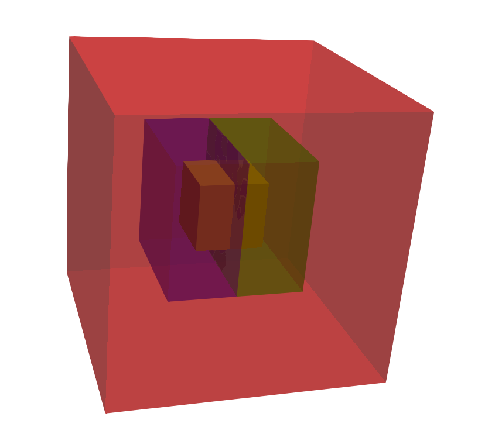
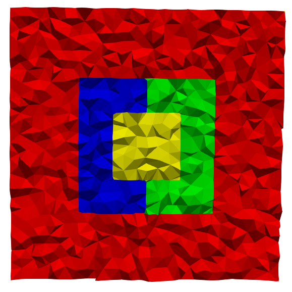

How to use SVMTK SubdomainMap.
~~~~~~~~~~~~~~~~~~~~~~~~~~~~~~~~~~~~~~~~

The mesh construction in SVMTK allows for marking cells with a specified values by using :class:`SVMTK.SubdomainMap`, which is done by mapping a binary string to a value (binary string is the overlapp of surfaces). This concept can be hard to fully understand, so we will give a short guide in how to use :class:`SVMTK.SubdomainMap`. 

In genereal, an arbitrary point can be located outside, inside or on the boundary of a surface. For the purpose of :class:`SVMTK.SubdomainMap`, we will not distingush between inside and on the boundary of a surface. Thus, we can write a points relative position to a surface as either outside (0) or inside (1). This check can be extended to all surface in the mesh construction. The result is written as a binary string, which used as input for :class:`SVMTK.SubdomainMap` that maps the input to a specified value. Then, the cell tag is determined by the tags of the cell vertices. (CHECK with CGAL)  
We will show this with the following example:

Let us start by constructing four cube surface, 

.. literalinclude:: ../../examples/Domain/example_four_cube_surfaces.py
   :lines: -40  

   
   ..
   
    Cube 1 is red, cube 2 is green, cube 3 is blue and cube 4 is yellow. 
   

Then, we set up the :class:`SVMTK.SubdomainMap` with the correct mapping. 

.. literalinclude:: ../../examples/Domain/example_four_cube_surfaces.py
   :lines: 41-48  

The addition of all combinations is inconvenient and cumbersome. Therefore, we can utilize the asterisk in the following manner. 

A prefix asterisk will fill inn all combinatiatons instead of the asterisk.   
Given four surface, then the string "\*\10" will generate 

* "0010" 
* "1010"
* "0110"
* "1110"

and vice versa for a suffix asterisk. Note that the use of asterisk requries that the number of surfaces to be specified.

(Write something)

.. literalinclude:: ../../examples/Domain/example_four_cube_surfaces.py
   :lines: 51-  

   
   ..
   
   Right: The original surface. Left: The repaired surface.
   
.. raw:: latex

    \newpage
